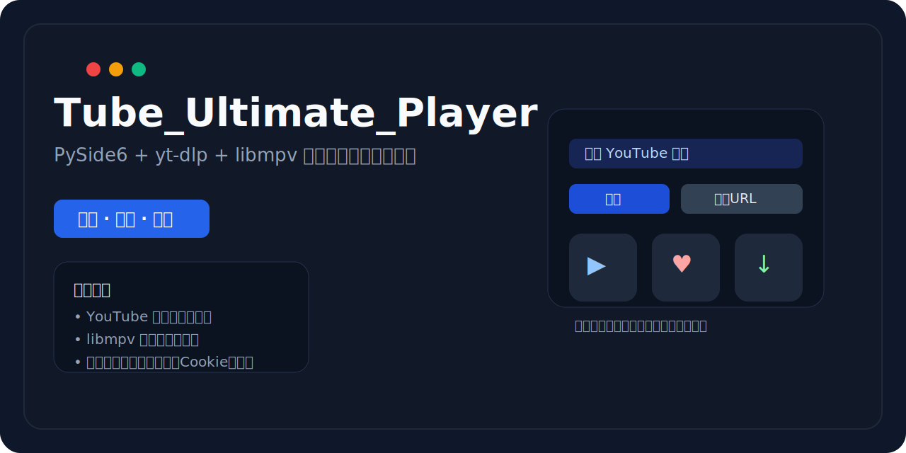
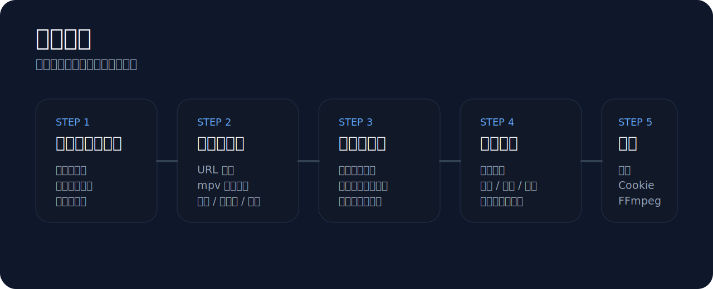

# Tube_Ultimate_Player

<p align="center">
  
</p>

<p align="center">
  <strong>基于 PySide6 + yt-dlp + libmpv 的 Windows / Linux 桌面视频播放器与下载工具</strong>
</p>

<p align="center">
  面向 YouTube 与 Bilibili 的搜索、首页浏览、URL 播放、播放列表管理与下载场景。
</p>

<p align="center">
  
  
  
  
  
  
</p>

## 亮点

- 同时支持 YouTube 与 Bilibili，两站点共用统一播放器、下载器、收藏与历史体系
- 支持首页推荐、关键词搜索、URL 直接播放、播放列表详情页与播放器侧滑播放列表面板
- 单视频播放后可在后台生成作者作品播放列表，不阻塞当前视频首帧播放
- 使用 `libmpv` 播放，支持暂停、停止、全屏、清晰度切换、倍速、字幕与自动隐藏控制面板
- 播放与暂停状态使用一致的控制面板滑入滑出逻辑，避免暂停画面长期被遮挡
- 播放器可一键使用系统默认浏览器打开当前在线视频原始页面
- 支持发现局域网 DLNA 播放设备，将在线视频和本地下载媒体远程投屏
- 投屏设备列表支持会话内缓存，后续打开时先快速校验 IP + 端口，缓存失效后再重新扫描
- 播放快捷键支持在设置页查看、修改、禁用、冲突校验和恢复默认
- 播放列表自动连播会在下一集加载后明确恢复播放，避免停留在暂停状态
- 内置下载队列，支持并发下载、暂停、继续、删除、完成回放与完成 toast 提示
- 下载列表、收藏和播放历史显示视频来源，并支持本地筛选搜索
- YouTube 与 Bilibili Cookie 内容独立保存，并随默认首页站点切换联动显示
- 在线升级下载完成后可自动关闭应用并启动安装；便携版支持退出后自动解压替换和重启
- 提供自带 Deno、FFmpeg 与 FFprobe 的增强安装包和免安装便携版，运行后无需再下载这些运行时
- 运行时配置、数据库、日志、下载目录统一写入 `%LocalAppData%\Tube_Ultimate_Player`
- Linux 首版面向 x86_64 的 X11/XWayland，提供自带 libmpv、Deno、FFmpeg 和 yt-dlp 的增强 AppImage/DEB 构建链路

## 界面与流程

<p align="center">
  
</p>

### 典型使用方式

1. 启动应用后进入默认首页，可选择 `Bilibili` 或 `YouTube`
2. 在顶部搜索框输入关键词，或通过“播放 URL”弹窗直接输入任意站点地址
3. 点击首页或搜索结果卡片中的“播放”，也可双击卡片、收藏、历史或播放列表条目开始播放
4. 在播放器中切换清晰度、倍速、全屏，点击“浏览器播放”打开原始页面，或点击“投屏”发送到局域网 DLNA 设备
5. 下载完成后，可直接在下载列表中双击本地文件再次播放
6. 在下载列表、收藏或历史页面中，可按标题、来源、作者或链接快速筛选

## 当前功能

| 模块 | 能力 |
| --- | --- |
| 首页 | YouTube / Bilibili 推荐内容、分页浏览、卡片独立播放/收藏/下载、长标题三行省略 |
| 搜索 | 双站点关键词搜索、分页、卡片独立播放/收藏/下载、等待动画与长标题三行省略 |
| URL 播放 | 弹窗输入 URL，自动识别 YouTube / Bilibili / 列表类链接 |
| 播放器 | `libmpv` 播放、暂停/继续、停止、自然结束重播、浏览器播放、全屏、快进/后退、静音、音量和播放列表快捷键、自动隐藏控制器 |
| 播放列表 | 明确播放列表、作者动态列表、侧滑播放列表面板、命名保存、自动连播、批量下载 |
| DLNA 投屏 | SSDP 多网卡发现、设备缓存校验、在线视频/本地媒体投屏、远程播放/暂停/停止、进度同步、Seek、音量控制 |
| 下载 | 下载队列、并发控制、暂停、继续、删除、来源显示、搜索、完成提示、本地文件播放 |
| 数据列表 | 收藏、历史、下载任务的来源显示、搜索筛选与统一表格布局 |
| 设置 | 常规与快捷键 Tab、代理、双站点独立 Cookie、仅显示已检测浏览器、FFmpeg、JS Runtime、下载目录、默认首页、快捷键自定义 |
| 关于 | 当前版本、GitHub 链接、检测新版本、Release Note 展示、Windows 自动升级与 Linux 手动升级包下载 |

## Bilibili 支持说明

当前版本已经接入以下 Bilibili 能力：

- 首页推荐
- 关键词搜索
- 单视频 URL 播放
- 下载
- 多 P 视频
- 番剧/剧集 `ep` / `ss`
- 稍后再看
- 收藏夹 / 媒体列表
- UP 主空间合集 / season 列表

搜索链路采用分层回退：

1. 优先使用浏览器已登录 Cookie 调用公开搜索 API
2. 失败时回退到 WBI 签名搜索 API
3. 仍失败时回退到搜索结果页抓取

## 快速开始

### 运行环境

- Windows 10 / 11；Linux 开发版目标为 Ubuntu 22.04/24.04 x86_64
- Python 3.10+
- `3rdpart/` 中的运行依赖文件

Linux 首版使用 X11，或在 Wayland 会话中通过 XWayland/xcb 运行，暂不承诺原生 Wayland。详细要求见
[`docs/linux_build_and_release.md`](docs/linux_build_and_release.md)。

### 安装依赖

```bash
pip install -r requirements.txt
```

### 启动

```bash
python main.py
```

## 目录结构

```text
Tube_Ultimate_Player/
├── 3rdpart/                  # 第三方二进制依赖（仓库内不提交 libmpv-2.dll 与 yt-dlp.exe）
├── config/                   # 默认配置模板
├── database/                 # SQLite 持久化与仓储
├── docs/                     # 设计文档、发布说明与 README 资源
│   ├── assets/
│   └── releases/
├── download/                 # 下载队列与下载 worker
├── dlna/                     # SSDP 发现、SOAP 控制、DIDL 与在线媒体 HTTP 中继
├── player/                   # libmpv 封装
├── resolver/                 # 站点解析、搜索、首页加载
├── resources/                # QSS 与图标资源
├── services/                 # 配置、日志、Cookie、升级、FFmpeg 等服务
├── ui/                       # PySide6 页面与组件
├── workers/                  # 后台线程任务
├── .github/workflows/        # 发布工作流
├── app_version.txt           # 当前正式版本号
├── build_installer.py        # 安装包构建脚本
├── build_linux.py            # Linux AppDir 与 DEB 构建脚本
├── build_portable.py         # 便携版构建脚本
├── build_portable_with_deno_ffmpeg.py # 自带 Deno/FFmpeg 的免安装便携版脚本
└── main.py
```

## 运行时目录

应用运行时会优先写入：

```text
%LocalAppData%\Tube_Ultimate_Player
```

其中包括：

- `config/user_config.json`
- `cookie_youtube.txt`
- `cookie_bilibili.txt`
- `data/tube_ultimate_player.sqlite3`
- `data/download_tasks.json`
- `downloads/`
- `logs/app.log`
- `logs/yt-dlp.log`
- `cache/`
- `updates/`

如果当前环境无法写入该目录，程序会回退到当前用户可写目录；在受限调试环境中，通常会回退到项目内的 `runtime/`。

Linux 使用 XDG Base Directory，配置、数据、缓存与日志分别写入：

```text
~/.config/Tube_Ultimate_Player
~/.local/share/Tube_Ultimate_Player
~/.cache/Tube_Ultimate_Player
~/.local/state/Tube_Ultimate_Player/logs
```

下载目录默认位于 XDG 用户视频目录下的 `Tube_Ultimate_Player/`。

## 构建与发布

### 版本号

发布版本统一从根目录 `app_version.txt` 读取，当前仓库使用正式版发布流程，不再使用预发布标签。

### GitHub Actions

仓库中提供 Windows 发布工作流以及两套 Linux 工作流：

- `release.yml`：完整正式发布流程，包含便携版、安装包构建与 GitHub Release 发布
- `release-portable.yml`：仅构建便携版
- `release-installer.yml`：仅构建安装包
- `release-installer-with-deno-ffmpeg.yml`：构建自带 Deno、FFmpeg 与 FFprobe 的增强安装包和增强便携版
- `test-linux.yml`：Ubuntu 单元测试与 Xvfb/libmpv 嵌入播放烟雾测试
- `release-linux.yml`：构建增强 AppImage 与增强 DEB，并校验捆绑运行时、许可证和 SHA256

正式发布流程会：

1. 读取 `app_version.txt`
2. 校验 `docs/releases/v<version>.md` 是否存在
3. 下载最新 `yt-dlp.exe`
4. 从 SourceForge 下载 `libmpv-2.dll`
5. 结合仓库中的其余 `3rdpart` 依赖构建产物
6. 运行 Ubuntu X11/libmpv 烟雾测试并构建增强 AppImage/DEB
7. 上传 Windows 普通/增强产物及 Linux 增强产物，并发布到 GitHub Releases

正式发布同时提供普通版本和增强版本。增强安装包及增强便携版文件名带有
`_with_deno_ffmpeg` 后缀，体积更大，但可直接使用内置 Deno 与 FFmpeg。

### 自带 Deno 与 FFmpeg 的免安装便携版

先将 `deno.exe`、`ffmpeg.exe` 和 `ffprobe.exe` 放入 `3rdpart/`，然后运行：

```bash
python build_portable_with_deno_ffmpeg.py
```

也可以直接使用：

```bash
python build_portable.py --with-deno-ffmpeg
```

输出文件名为 `Tube_Ultimate_Player_portable_v<version>_with_deno_ffmpeg.zip`，解压后即可运行。

### Linux 增强 AppImage 与 DEB

Linux 构建会优先生成：

```text
Tube_Ultimate_Player_v<version>_x86_64_with_deno_ffmpeg.AppImage
tube-ultimate-player_<version>_amd64_with_deno_ffmpeg.deb
```

AppImage 必须捆绑 libmpv；增强产物同时包含 Deno、FFmpeg/FFprobe 和 yt-dlp。Linux 首版只下载升级包，不自动提权或安装。完整构建、依赖和验收流程见
[`docs/linux_build_and_release.md`](docs/linux_build_and_release.md)。

## JS Runtime 说明

部分站点解析链路依赖 JS Runtime。若系统未安装 Node.js，可在“设置”页直接检测并触发安装。

若用户不希望自动安装，也可以手动安装 Node.js：

1. 前往官方站点：https://nodejs.org/
2. 安装 LTS 版本
3. 重启应用后重新检测

## 播放快捷键

快捷键可在“设置 → 快捷键”中查看、修改、禁用或恢复默认配置。

| 默认按键 | 功能 |
| --- | --- |
| `Space` | 播放 / 暂停 |
| `S` | 停止 |
| `D` | 下载当前视频 |
| `C` | 收藏当前视频 |
| `Ctrl+C` | 投屏 / 停止投屏 |
| `Enter / Return` | 全屏 / 退出全屏 |
| `← / →` | 后退 / 前进 10 秒 |
| `Ctrl+← / Ctrl+→` | 后退 / 前进 60 秒 |
| `↑ / ↓` | 音量增加 / 降低 5 |
| `M` | 静音 / 恢复音量 |
| `Home / End` | 跳转到开头 / 结尾 |
| `PageUp / PageDown` | 播放列表上一项 / 下一项 |

输入焦点位于搜索框、Cookie 文本框等编辑控件时，播放器快捷键会暂时停用，避免输入文字时误触播放操作。

## 0.2.10 更新摘要

- 新增面向 Ubuntu 22.04/24.04 x86_64 的 Linux 支持。
- Wayland 桌面通过 XWayland/xcb 运行，首版暂不支持原生 Wayland 嵌入。
- Linux 遵循 XDG 配置、数据、缓存、状态和视频目录规范。
- AppImage 捆绑 libmpv，并优先提供自带 Deno、FFmpeg/FFprobe、yt-dlp 的增强版本。
- 新增增强 AppImage、DEB 构建链路及 Ubuntu Xvfb/libmpv 播放烟雾测试。
- 支持 Linux Chrome/Chromium/Brave/Firefox 原生、Snap 和 Flatpak Cookie Profile 探测。
- Linux 在线升级只下载匹配资产，不自动提权或安装系统包。
- 修复 Ubuntu CI 直接运行 libmpv 烟雾测试时的项目模块导入路径。

完整说明见 [`docs/releases/v0.2.10.md`](docs/releases/v0.2.10.md)。

## DLNA 投屏说明

1. 电脑与电视/盒子需要位于同一局域网。
2. 播放在线视频后，点击控制面板中“全屏”之前的“投屏”按钮。
3. 首次打开会扫描局域网设备；后续打开会优先校验缓存设备，在线设备直接展示。
4. 选择设备并开始投屏；投屏成功后本地播放自动暂停。
5. 投屏期间播放、暂停、停止、音量和可用的进度控制会路由到远端设备。
6. Bilibili 和部分 YouTube 清晰度使用分离音视频流，需要在设置中配置 FFmpeg；应用会实时封装为电视可播放的 MPEG-TS，不重新编码视频。
7. 下载列表中的本地视频、音频也可投屏，设备通过局域网 HTTP 服务读取文件。
8. 实时封装流不支持字节 Range，因此本期禁用进度拖动；停止投屏时会按电视最近进度恢复本地播放。
9. 如果搜索不到设备，请检查系统防火墙、路由器组播设置，并确认设备支持 DLNA MediaRenderer/AVTransport。

## 下载、收藏与历史

- 三个列表统一使用黑底金边表格风格，避免深色主题下出现白底白字不可读的问题。
- 下载任务、收藏和播放历史均显示来源（`YouTube` / `Bilibili`）。
- 收藏和播放历史保存作者信息；旧 SQLite 数据库启动时会自动补充缺失字段。
- 列表搜索为本地即时筛选，不会重复请求站点接口。

## 测试

运行完整自动化测试（当前版本共 `81` 项）：

```bash
python -m unittest discover -s tests -p "test_*.py"
```

## 第三方组件与合规声明

本项目依赖或调用以下第三方组件：

- [PySide6](https://doc.qt.io/qtforpython/)
- [yt-dlp](https://github.com/yt-dlp/yt-dlp)
- [mpv / libmpv](https://mpv.io/)
- [FFmpeg](https://ffmpeg.org/)

其中：

- `yt-dlp.exe` 为独立第三方可执行文件，本项目仅调用其公开命令行能力
- `libmpv-2.dll` 为独立第三方动态库，本项目通过 `ctypes` 调用其公开接口
- FFmpeg 由用户本机或设置页指定路径提供，本项目不修改其行为

更多说明见 [THIRD_PARTY_NOTICES.md](THIRD_PARTY_NOTICES.md)。

### 合规性声明

1. 本项目是通用桌面客户端，不提供任何受版权保护内容的托管、镜像或转售服务。
2. 用户应仅在拥有合法权利、授权或当地法律允许的情况下使用本工具访问、播放或下载内容。
3. 用户应自行遵守 YouTube、Bilibili 及相关平台的服务条款、版权政策、地区限制、年龄限制和其他适用规则。
4. 本项目不保证对任何第三方平台的持续可用性、兼容性或访问权限。
5. 用户导入的 Cookie、代理、账号状态及下载行为均由用户自行负责；仓库不包含任何真实个人 Cookie、账号数据或私有配置。
6. 本项目对第三方软件和服务的引用仅用于兼容与集成说明，不代表对其拥有权或附带再授权。

## 仓库说明

为避免个人数据泄露，以下内容不应提交到仓库：

- `cookie_youtube.txt`
- `cookie_bilibili.txt`
- `config/user_config.json`
- `logs/`
- `downloads/`
- `cache/`
- `data/`
- `runtime/`
- `updates/`
- `__pycache__/`

这些内容已在 `.gitignore` 中忽略。

## 社区

[LINUX DO](https://linux.do)
