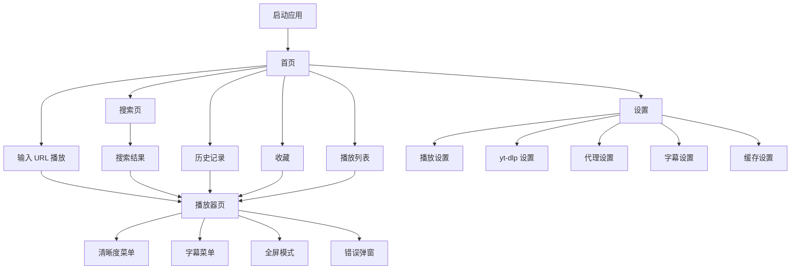
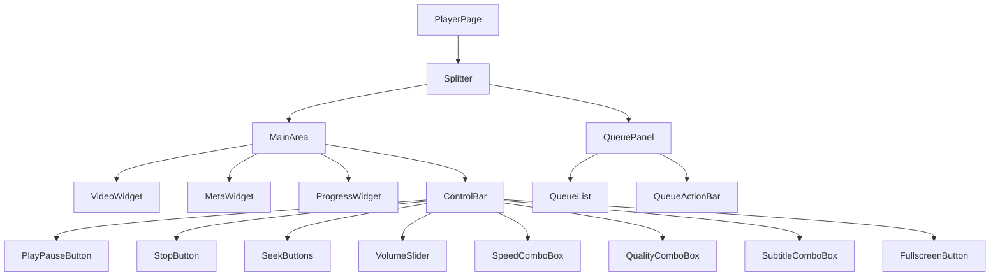

# YouTube 桌面播放器详细设计文档

> 技术方案：**PySide6 + libmpv + yt-dlp + SQLite**  
> 方案路线：**应用主动调用 yt-dlp 获取真实媒体流，再交给 libmpv 播放**  
> 文档版本：v1.0  
> 适用目标：可落地实现的桌面 YouTube 播放器 MVP / 进阶版架构设计

---

## 目录

- [1. 项目概述](#1-项目概述)
- [2. 技术可行性结论](#2-技术可行性结论)
- [3. 总体架构](#3-总体架构)
- [4. 技术选型](#4-技术选型)
- [5. 功能范围](#5-功能范围)
- [6. 项目目录结构](#6-项目目录结构)
- [7. 核心模块设计](#7-核心模块设计)
- [8. yt-dlp 调用设计](#8-yt-dlp-调用设计)
- [9. 视频格式与清晰度选择策略](#9-视频格式与清晰度选择策略)
- [10. libmpv 播放器设计](#10-libmpv-播放器设计)
- [11. PySide6 UI 设计](#11-pyside6-ui-设计)
- [12. 播放流程设计](#12-播放流程设计)
- [13. 字幕系统设计](#13-字幕系统设计)
- [14. 搜索系统设计](#14-搜索系统设计)
- [15. 缓存系统设计](#15-缓存系统设计)
- [16. SQLite 数据库设计](#16-sqlite-数据库设计)
- [17. 多线程与异步任务设计](#17-多线程与异步任务设计)
- [18. 播放器状态机](#18-播放器状态机)
- [19. 错误处理与降级策略](#19-错误处理与降级策略)
- [20. 配置系统设计](#20-配置系统设计)
- [21. 日志系统设计](#21-日志系统设计)
- [22. 打包发布方案](#22-打包发布方案)
- [23. 开发里程碑](#23-开发里程碑)
- [24. 关键技术难点](#24-关键技术难点)
- [25. 最小可运行示例设计](#25-最小可运行示例设计)
- [26. 后续扩展方向](#26-后续扩展方向)
- [27. 实施建议总结](#27-实施建议总结)
- [28. UI 界面设计图](#28-ui-界面设计图)

---

# 1. 项目概述

## 1.1 项目目标

本项目目标是开发一个跨平台桌面 YouTube 播放器，核心能力包括：

- 输入 YouTube 视频 URL 后播放；
- 搜索 YouTube 视频；
- 选择清晰度；
- 加载字幕；
- 播放、暂停、进度跳转、倍速、音量控制；
- 历史记录与收藏；
- 播放列表；
- 本地缓存元数据、封面和字幕；
- 后续扩展 SponsorBlock、Shorts 模式、账号登录等功能。

## 1.2 设计原则

项目采用分层架构，核心原则如下：

```text
UI 与业务逻辑解耦
播放内核与视频解析解耦
YouTube 解析与缓存解耦
数据库访问与业务服务解耦
耗时操作禁止阻塞 UI 线程
所有外部依赖统一封装
```

## 1.3 目标平台

优先支持：

```text
Windows 10/11
Linux Desktop
macOS
```

MVP 阶段可以优先支持 Windows + Linux。

---

# 2. 技术可行性结论

采用 **PySide6 + libmpv + yt-dlp** 开发 YouTube 桌面播放器是可行的。

核心原因：

1. **PySide6** 负责桌面 GUI，适合构建复杂桌面应用；
2. **libmpv** 负责播放内核，成熟、稳定、支持硬件加速和网络流；
3. **yt-dlp** 负责解析 YouTube，避免自行维护 YouTube 复杂且频繁变化的签名解析逻辑；
4. **SQLite** 负责本地历史、收藏、缓存索引；
5. 应用主动调用 yt-dlp，可以获得更强的业务控制能力，例如选择清晰度、字幕、预加载和缓存。

需要注意：

> 项目最大难点不是播放器 UI，也不是 libmpv 嵌入，而是 YouTube 视频源解析、字幕、直播、地区限制、账号登录和接口变化。

---

# 3. 总体架构

## 3.1 架构图

```text
┌────────────────────────────────────┐
│             PySide6 UI             │
│                                    │
│ MainWindow / PlayerPage / Search   │
└─────────────────┬──────────────────┘
                  │
                  ▼
┌────────────────────────────────────┐
│          Application Services       │
│                                    │
│ YoutubeService                     │
│ PlaylistService                    │
│ HistoryService                     │
│ FavoriteService                    │
│ CacheService                       │
└─────────────────┬──────────────────┘
                  │
                  ▼
┌────────────────────────────────────┐
│          Youtube Resolver           │
│                                    │
│ yt-dlp extract_info                │
│ Format Parser                      │
│ Quality Selector                   │
│ Subtitle Parser                    │
└─────────────────┬──────────────────┘
                  │
                  ▼
┌────────────────────────────────────┐
│              MPV Player             │
│                                    │
│ libmpv                             │
│ Video Output                       │
│ Audio Output                       │
│ Subtitle Output                    │
└─────────────────┬──────────────────┘
                  │
                  ▼
          YouTube DASH/HLS Streams
```

## 3.2 数据流

```text
用户点击视频
   ↓
UI 发送播放请求
   ↓
YoutubeService 调用 YoutubeResolver
   ↓
yt-dlp 获取视频信息 JSON
   ↓
QualitySelector 选择 video/audio stream
   ↓
SubtitleParser 提取字幕列表
   ↓
生成 VideoInfo
   ↓
CacheService 写入缓存
   ↓
MPVPlayer 加载 video_url 和 audio_url
   ↓
开始播放
```

---

# 4. 技术选型

## 4.1 Python

建议版本：

```text
Python 3.11+
Python 3.12 推荐
```

原因：

- 类型提示完善；
- 性能较好；
- PySide6、yt-dlp、python-mpv 生态兼容性较好。

## 4.2 PySide6

用途：

- 主窗口；
- 播放器容器；
- 搜索界面；
- 播放列表；
- 设置页；
- 对话框；
- 信号槽通信。

## 4.3 libmpv / python-mpv

用途：

- 视频解码；
- 音频输出；
- 字幕加载；
- 硬件加速；
- 进度控制；
- 倍速控制；
- 播放状态监听。

## 4.4 yt-dlp

用途：

- 获取 YouTube 视频元数据；
- 获取视频真实流地址；
- 获取音频真实流地址；
- 获取字幕信息；
- 获取封面、标题、时长、频道等元信息。

## 4.5 SQLite

用途：

- 播放历史；
- 收藏；
- 本地播放列表；
- 缓存索引；
- 设置项。

---

# 5. 功能范围

## 5.1 MVP 功能

MVP 阶段必须实现：

```text
1. 输入 YouTube URL 播放
2. 播放 / 暂停 / 停止
3. 进度条拖动
4. 音量控制
5. 倍速控制
6. 获取视频标题、封面、时长
7. 自动选择最佳清晰度
8. 手动切换清晰度
9. 加载字幕
10. 播放历史记录
```

## 5.2 第二阶段功能

```text
1. YouTube 搜索
2. 收藏视频
3. 本地播放列表
4. 封面缓存
5. 字幕缓存
6. 视频元数据缓存
7. 下一集预加载
```

## 5.3 第三阶段功能

```text
1. Shorts 模式
2. SponsorBlock
3. 直播支持
4. 多语言字幕切换
5. 自动字幕翻译入口
6. 主题皮肤
7. 键盘快捷键完整支持
```

## 5.4 不建议 MVP 阶段实现的功能

```text
1. Google 账号登录
2. 订阅同步
3. 评论发布
4. 官方推荐流复刻
5. YouTube Premium 相关能力
```

这些功能涉及账号风控、OAuth、Cookie、地区策略和接口稳定性，建议延后。

---

# 6. 项目目录结构

推荐目录如下：

```text
tubeplayer/
├── main.py
├── requirements.txt
├── README.md
├── config/
│   ├── default_config.json
│   └── user_config.json
├── ui/
│   ├── main_window.py
│   ├── player_widget.py
│   ├── search_page.py
│   ├── playlist_page.py
│   ├── history_page.py
│   ├── favorite_page.py
│   ├── settings_page.py
│   └── dialogs/
│       ├── error_dialog.py
│       └── quality_dialog.py
├── player/
│   ├── mpv_player.py
│   ├── player_state.py
│   ├── player_events.py
│   └── playback_controller.py
├── resolver/
│   ├── youtube_resolver.py
│   ├── quality_selector.py
│   ├── subtitle_parser.py
│   └── models.py
├── services/
│   ├── youtube_service.py
│   ├── search_service.py
│   ├── playlist_service.py
│   ├── history_service.py
│   ├── favorite_service.py
│   ├── cache_service.py
│   └── config_service.py
├── database/
│   ├── sqlite_manager.py
│   ├── history_repository.py
│   ├── favorite_repository.py
│   ├── playlist_repository.py
│   └── schema.sql
├── workers/
│   ├── resolver_worker.py
│   ├── search_worker.py
│   ├── thumbnail_worker.py
│   └── subtitle_worker.py
├── cache/
│   ├── thumbnails/
│   ├── subtitles/
│   ├── metadata/
│   └── logs/
├── resources/
│   ├── icons/
│   ├── qss/
│   └── fonts/
└── tests/
    ├── test_resolver.py
    ├── test_quality_selector.py
    └── test_database.py
```

---

# 7. 核心模块设计

## 7.1 数据模型

### VideoInfo

```python
from dataclasses import dataclass, field
from typing import Optional

@dataclass
class VideoInfo:
    video_id: str
    title: str
    description: str = ""
    uploader: str = ""
    channel_id: str = ""
    duration: int = 0
    upload_date: str = ""
    webpage_url: str = ""
    thumbnail: str = ""
    qualities: dict = field(default_factory=dict)
    subtitles: dict = field(default_factory=dict)
    automatic_captions: dict = field(default_factory=dict)
    raw_info: Optional[dict] = None
```

### VideoQuality

```python
from dataclasses import dataclass
from typing import Optional

@dataclass
class VideoQuality:
    label: str
    height: int
    width: int
    fps: int
    vcodec: str
    acodec: str
    ext: str
    format_id: str
    video_url: str
    audio_url: Optional[str] = None
    audio_format_id: Optional[str] = None
    filesize: Optional[int] = None
    tbr: Optional[float] = None
```

### SubtitleInfo

```python
from dataclasses import dataclass

@dataclass
class SubtitleInfo:
    language: str
    ext: str
    url: str
    is_auto: bool = False
```

### SearchResult

```python
from dataclasses import dataclass

@dataclass
class SearchResult:
    video_id: str
    title: str
    channel_title: str
    thumbnail: str
    published_at: str
    description: str = ""
```

---

# 8. yt-dlp 调用设计

## 8.1 基础调用原则

应用负责调用 yt-dlp，不让 mpv 内部自动调用 yt-dlp。

好处：

- 可以提前拿到元数据；
- 可以选择清晰度；
- 可以展示字幕列表；
- 可以缓存解析结果；
- 可以预加载下一视频；
- 错误信息可控。

## 8.2 推荐基础参数

```python
YTDLP_BASE_OPTIONS = {
    "quiet": True,
    "no_warnings": True,
    "skip_download": True,
    "noplaylist": True,
    "ignoreerrors": False,
    "extract_flat": False,
    "socket_timeout": 30,
    "retries": 5,
    "fragment_retries": 5,
    "geo_bypass": True,
}
```

## 8.3 字幕相关参数

```python
YTDLP_SUBTITLE_OPTIONS = {
    "writesubtitles": True,
    "writeautomaticsub": True,
    "subtitleslangs": [
        "zh-Hans",
        "zh-Hant",
        "zh",
        "en"
    ],
    "subtitlesformat": "vtt/srt/best",
}
```

## 8.4 格式相关参数

对于播放器场景，建议不要强行只让 yt-dlp 选一个格式，而是拿完整 formats，自行选择：

```python
YTDLP_FORMAT_OPTIONS = {
    "format": "bestvideo+bestaudio/best",
}
```

说明：

- `bestvideo+bestaudio/best` 可以作为默认兜底；
- 实际项目中仍应读取 `info["formats"]`，通过 QualitySelector 自行构建清晰度列表；
- 如果只依赖 yt-dlp 自动选择，会限制 UI 端清晰度切换能力。

## 8.5 网络与 Cookie 参数

如需支持用户自行导入浏览器 Cookie，可设计可选参数：

```python
YTDLP_COOKIE_OPTIONS = {
    "cookiefile": "cookies.txt",
}
```

如需设置代理：

```python
YTDLP_PROXY_OPTIONS = {
    "proxy": "http://127.0.0.1:7890",
}
```

## 8.6 完整推荐配置

```python
YTDLP_OPTIONS = {
    "quiet": True,
    "no_warnings": True,
    "skip_download": True,
    "noplaylist": True,
    "ignoreerrors": False,
    "extract_flat": False,
    "socket_timeout": 30,
    "retries": 5,
    "fragment_retries": 5,
    "geo_bypass": True,

    "writesubtitles": True,
    "writeautomaticsub": True,
    "subtitleslangs": ["zh-Hans", "zh-Hant", "zh", "en"],
    "subtitlesformat": "vtt/srt/best",

    "format": "bestvideo+bestaudio/best",
}
```

## 8.7 Resolver 示例实现

```python
import yt_dlp

class YoutubeResolver:
    def __init__(self, options=None):
        self.options = options or YTDLP_OPTIONS

    def resolve(self, url: str):
        with yt_dlp.YoutubeDL(self.options) as ydl:
            info = ydl.extract_info(url, download=False)

        if not info:
            raise RuntimeError("无法解析视频信息")

        return self._parse_info(info)

    def _parse_info(self, info: dict):
        qualities = QualitySelector.select_all(info.get("formats", []))
        subtitles = SubtitleParser.parse(
            info.get("subtitles", {}),
            info.get("automatic_captions", {})
        )

        return VideoInfo(
            video_id=info.get("id", ""),
            title=info.get("title", ""),
            description=info.get("description", ""),
            uploader=info.get("uploader", ""),
            channel_id=info.get("channel_id", ""),
            duration=info.get("duration") or 0,
            upload_date=info.get("upload_date", ""),
            webpage_url=info.get("webpage_url", ""),
            thumbnail=info.get("thumbnail", ""),
            qualities=qualities,
            subtitles=subtitles,
            automatic_captions=info.get("automatic_captions", {}),
            raw_info=info,
        )
```

---

# 9. 视频格式与清晰度选择策略

## 9.1 YouTube 常见格式结构

YouTube 通常提供分离流：

```text
视频流：仅视频，无音频
音频流：仅音频，无视频
```

典型格式：

```text
137  1080p avc1 video only
248  1080p vp9  video only
399  1080p av01 video only
140  m4a   audio only
251  opus  audio only
```

## 9.2 视频流筛选

```python
def is_video_format(fmt: dict) -> bool:
    return fmt.get("vcodec") not in (None, "none")
```

## 9.3 音频流筛选

```python
def is_audio_format(fmt: dict) -> bool:
    return fmt.get("acodec") not in (None, "none")
```

## 9.4 排除无 URL 格式

部分格式可能没有直接 URL，需要跳过：

```python
def has_url(fmt: dict) -> bool:
    return bool(fmt.get("url"))
```

## 9.5 编码优先级

建议策略：

```text
H.264/AVC：兼容性最好
VP9：压缩效率好，现代设备支持较好
AV1：压缩效率最高，但旧设备可能解码压力大
```

MVP 推荐优先级：

```text
avc1 > vp9 > av01
```

如果用户设备较新，可以允许设置为：

```text
av01 > vp9 > avc1
```

## 9.6 音频优先级

推荐：

```text
opus > m4a/aac > mp3
```

## 9.7 QualitySelector 示例

```python
class QualitySelector:
    VIDEO_CODEC_PRIORITY = {
        "avc1": 300,
        "vp9": 200,
        "vp09": 200,
        "av01": 100,
    }

    AUDIO_CODEC_PRIORITY = {
        "opus": 300,
        "mp4a": 200,
        "aac": 200,
        "mp3": 100,
    }

    @classmethod
    def select_all(cls, formats: list[dict]) -> dict:
        videos = [
            f for f in formats
            if f.get("vcodec") not in (None, "none") and f.get("url")
        ]

        audios = [
            f for f in formats
            if f.get("acodec") not in (None, "none")
            and f.get("vcodec") in (None, "none")
            and f.get("url")
        ]

        if not videos:
            return {}

        best_audio = cls.select_best_audio(audios)
        grouped = {}

        for video in videos:
            height = video.get("height") or 0
            if height <= 0:
                continue

            label = f"{height}p"
            old = grouped.get(label)

            if old is None or cls.score_video(video) > cls.score_video(old):
                grouped[label] = video

        results = {}
        for label, video in grouped.items():
            results[label] = VideoQuality(
                label=label,
                height=video.get("height") or 0,
                width=video.get("width") or 0,
                fps=video.get("fps") or 0,
                vcodec=video.get("vcodec") or "",
                acodec="none",
                ext=video.get("ext") or "",
                format_id=video.get("format_id") or "",
                video_url=video.get("url") or "",
                audio_url=best_audio.get("url") if best_audio else None,
                audio_format_id=best_audio.get("format_id") if best_audio else None,
                filesize=video.get("filesize") or video.get("filesize_approx"),
                tbr=video.get("tbr"),
            )

        return dict(
            sorted(
                results.items(),
                key=lambda item: item[1].height,
                reverse=True
            )
        )

    @classmethod
    def select_best_audio(cls, audios: list[dict]):
        if not audios:
            return None
        return sorted(audios, key=cls.score_audio, reverse=True)[0]

    @classmethod
    def score_video(cls, fmt: dict) -> int:
        codec = fmt.get("vcodec", "")
        codec_score = 0
        for key, score in cls.VIDEO_CODEC_PRIORITY.items():
            if key in codec:
                codec_score = score
                break

        return (
            (fmt.get("height") or 0) * 10000
            + (fmt.get("fps") or 0) * 100
            + codec_score
            + int(fmt.get("tbr") or 0)
        )

    @classmethod
    def score_audio(cls, fmt: dict) -> int:
        codec = fmt.get("acodec", "")
        codec_score = 0
        for key, score in cls.AUDIO_CODEC_PRIORITY.items():
            if key in codec:
                codec_score = score
                break

        return codec_score * 10000 + int(fmt.get("abr") or 0)
```

---

# 10. libmpv 播放器设计

## 10.1 初始化参数

推荐参数：

```python
MPV_OPTIONS = {
    "vo": "gpu-next",
    "hwdec": "auto-safe",
    "keep-open": "yes",
    "cache": "yes",
    "demuxer-max-bytes": "500M",
    "demuxer-max-back-bytes": "100M",
    "cache-secs": "20",
    "profile": "fast",
    "alang": "zh,en",
    "slang": "zh,en",
}
```

兼容性更保守的参数：

```python
MPV_SAFE_OPTIONS = {
    "vo": "gpu",
    "hwdec": "auto-safe",
    "keep-open": "yes",
    "cache": "yes",
}
```

## 10.2 PySide6 嵌入 mpv

核心思路：

```text
QWidget 获取 winId
    ↓
传给 mpv wid 参数
    ↓
mpv 将视频渲染到该 QWidget
```

示例：

```python
import mpv
from PySide6.QtWidgets import QWidget

class MpvPlayer:
    def __init__(self, video_widget: QWidget):
        self.video_widget = video_widget
        self.player = mpv.MPV(
            wid=str(int(video_widget.winId())),
            vo="gpu-next",
            hwdec="auto-safe",
            keep_open="yes",
            cache="yes",
        )

    def load(self, video_url: str, audio_url: str | None = None):
        self.player.command("loadfile", video_url, "replace")
        if audio_url:
            self.player.command("audio-add", audio_url, "auto")

    def pause(self):
        self.player.pause = True

    def resume(self):
        self.player.pause = False

    def stop(self):
        self.player.command("stop")

    def seek(self, seconds: float):
        self.player.command("seek", seconds, "absolute")

    def set_volume(self, volume: int):
        self.player.volume = volume

    def set_speed(self, speed: float):
        self.player.speed = speed
```

## 10.3 事件监听

```python
class MpvPlayer:
    def observe(self):
        self.player.observe_property("time-pos", self.on_time_pos)
        self.player.observe_property("duration", self.on_duration)
        self.player.observe_property("pause", self.on_pause)
        self.player.observe_property("eof-reached", self.on_eof)

    def on_time_pos(self, name, value):
        pass

    def on_duration(self, name, value):
        pass

    def on_pause(self, name, value):
        pass

    def on_eof(self, name, value):
        pass
```

实际项目中应将这些回调转换为 Qt Signal，再更新 UI。

---

# 11. PySide6 UI 设计

## 11.1 主窗口布局

```text
┌────────────────────────────────────────────┐
│ Toolbar                                    │
├───────────────┬────────────────────────────┤
│ Sidebar       │ Player / Search / History  │
│               │                            │
│ Home          │                            │
│ Search        │                            │
│ Playlist      │                            │
│ History       │                            │
│ Favorite      │                            │
│ Settings      │                            │
└───────────────┴────────────────────────────┘
```

## 11.2 播放页布局

```text
┌────────────────────────────────────────────┐
│ VideoWidget                                │
│                                            │
│                                            │
├────────────────────────────────────────────┤
│ Title                                      │
├────────────────────────────────────────────┤
│ Progress Slider                            │
├────────────────────────────────────────────┤
│ Play Pause Stop Volume Speed Quality Sub   │
└────────────────────────────────────────────┘
```

## 11.3 控制栏组件

```text
播放/暂停按钮
停止按钮
上一集/下一集按钮
进度条
当前时间
总时长
音量滑块
倍速选择
清晰度选择
字幕选择
全屏按钮
```

## 11.4 UI 与服务通信

```text
UI 点击播放
  ↓
发出 playRequested(url)
  ↓
YoutubeService 处理
  ↓
ResolverWorker 后台解析
  ↓
返回 VideoInfo
  ↓
PlaybackController 调用 MpvPlayer
  ↓
UI 更新标题、封面、清晰度、字幕列表
```

---

# 12. 播放流程设计

## 12.1 URL 播放流程

```text
用户输入 URL
   ↓
校验 URL
   ↓
创建 ResolverWorker
   ↓
yt-dlp extract_info
   ↓
解析 formats
   ↓
选择默认清晰度
   ↓
加载到 mpv
   ↓
记录历史
```

## 12.2 清晰度切换流程

```text
用户选择 720p
   ↓
保存当前播放位置 time_pos
   ↓
调用 MPV load(new_video_url, audio_url)
   ↓
seek 回原位置
   ↓
继续播放
```

示例：

```python
def switch_quality(self, quality: VideoQuality):
    pos = self.mpv_player.current_position()
    paused = self.mpv_player.is_paused()

    self.mpv_player.load(quality.video_url, quality.audio_url)
    self.mpv_player.seek(pos)

    if paused:
        self.mpv_player.pause()
    else:
        self.mpv_player.resume()
```

## 12.3 播放列表流程

```text
播放当前视频
   ↓
后台预解析下一个视频
   ↓
当前播放结束
   ↓
直接加载已解析的 next_video_info
   ↓
继续后台预解析下下个视频
```

---

# 13. 字幕系统设计

## 13.1 字幕来源

yt-dlp 返回：

```python
info["subtitles"]
info["automatic_captions"]
```

其中：

```text
subtitles：人工字幕
automatic_captions：自动字幕
```

## 13.2 字幕解析

```python
class SubtitleParser:
    @staticmethod
    def parse(subtitles: dict, automatic_captions: dict) -> dict:
        result = {}

        for lang, items in subtitles.items():
            for item in items:
                result[f"{lang}-manual"] = SubtitleInfo(
                    language=lang,
                    ext=item.get("ext", ""),
                    url=item.get("url", ""),
                    is_auto=False,
                )

        for lang, items in automatic_captions.items():
            for item in items:
                result[f"{lang}-auto"] = SubtitleInfo(
                    language=lang,
                    ext=item.get("ext", ""),
                    url=item.get("url", ""),
                    is_auto=True,
                )

        return result
```

## 13.3 字幕加载策略

推荐流程：

```text
用户选择字幕
   ↓
检查本地缓存
   ↓
没有则下载字幕文件
   ↓
保存到 cache/subtitles
   ↓
mpv sub-add
```

示例：

```python
def add_subtitle(self, subtitle_path: str):
    self.player.command("sub-add", subtitle_path, "select")
```

## 13.4 字幕文件命名

```text
cache/subtitles/{video_id}/{lang}_{type}.{ext}
```

示例：

```text
cache/subtitles/abc123/zh-Hans_manual.vtt
cache/subtitles/abc123/en_auto.vtt
```

---

# 14. 搜索系统设计

## 14.1 推荐方式

推荐使用：

```text
YouTube Data API v3
```

原因：

- 结构稳定；
- 搜索结果字段清晰；
- 可获取标题、频道、封面、发布时间；
- 比直接解析网页更可维护。

## 14.2 搜索服务接口

```python
class SearchService:
    def search(self, keyword: str, page_token: str | None = None) -> list[SearchResult]:
        pass
```

## 14.3 搜索结果模型

```python
@dataclass
class SearchPageResult:
    items: list[SearchResult]
    next_page_token: str | None = None
```

## 14.4 无 API Key 替代方案

如果不使用官方 API，可选方式：

```text
yt-dlp ytsearch10:keyword
```

示例：

```python
opts = {
    "quiet": True,
    "skip_download": True,
    "extract_flat": True,
}

with yt_dlp.YoutubeDL(opts) as ydl:
    info = ydl.extract_info("ytsearch10:python tutorial", download=False)
```

优点：

```text
无需 API Key
开发简单
```

缺点：

```text
搜索结果字段有限
稳定性和速度不如官方 API
分页能力较弱
```

MVP 阶段可以先使用 `ytsearch10:`，后续再接 YouTube Data API。

---

# 15. 缓存系统设计

## 15.1 缓存目录

```text
cache/
├── thumbnails/
├── subtitles/
├── metadata/
└── logs/
```

## 15.2 缓存内容

```text
视频元数据 JSON
封面图片
字幕文件
搜索结果
播放列表预解析结果
```

## 15.3 元数据缓存

文件路径：

```text
cache/metadata/{video_id}.json
```

存储内容：

```json
{
  "video_id": "abc123",
  "title": "Example Video",
  "duration": 300,
  "thumbnail": "https://...",
  "qualities": {},
  "subtitles": {},
  "cached_at": "2026-07-06T15:32:00"
}
```

## 15.4 缓存过期策略

建议：

```text
封面：30 天
字幕：30 天
元数据：6 小时到 24 小时
真实流地址：不长期缓存
```

重点：

> YouTube 真实流 URL 通常具有时效性，不建议长期缓存。可以缓存元信息，但播放前必要时重新解析真实 URL。

---

# 16. SQLite 数据库设计

## 16.1 history 表

```sql
CREATE TABLE IF NOT EXISTS history (
    id INTEGER PRIMARY KEY AUTOINCREMENT,
    video_id TEXT NOT NULL,
    title TEXT NOT NULL,
    webpage_url TEXT,
    thumbnail TEXT,
    duration INTEGER DEFAULT 0,
    watched_position INTEGER DEFAULT 0,
    play_count INTEGER DEFAULT 1,
    last_played_at TEXT NOT NULL,
    created_at TEXT NOT NULL
);
```

## 16.2 favorite 表

```sql
CREATE TABLE IF NOT EXISTS favorite (
    id INTEGER PRIMARY KEY AUTOINCREMENT,
    video_id TEXT NOT NULL UNIQUE,
    title TEXT NOT NULL,
    webpage_url TEXT,
    thumbnail TEXT,
    uploader TEXT,
    duration INTEGER DEFAULT 0,
    created_at TEXT NOT NULL
);
```

## 16.3 playlist 表

```sql
CREATE TABLE IF NOT EXISTS playlist (
    id INTEGER PRIMARY KEY AUTOINCREMENT,
    name TEXT NOT NULL,
    description TEXT,
    created_at TEXT NOT NULL,
    updated_at TEXT NOT NULL
);
```

## 16.4 playlist_item 表

```sql
CREATE TABLE IF NOT EXISTS playlist_item (
    id INTEGER PRIMARY KEY AUTOINCREMENT,
    playlist_id INTEGER NOT NULL,
    video_id TEXT NOT NULL,
    title TEXT NOT NULL,
    webpage_url TEXT,
    thumbnail TEXT,
    sort_order INTEGER DEFAULT 0,
    created_at TEXT NOT NULL,
    FOREIGN KEY (playlist_id) REFERENCES playlist(id)
);
```

## 16.5 settings 表

```sql
CREATE TABLE IF NOT EXISTS settings (
    key TEXT PRIMARY KEY,
    value TEXT NOT NULL,
    updated_at TEXT NOT NULL
);
```

---

# 17. 多线程与异步任务设计

## 17.1 原则

禁止在 UI 线程执行：

```text
yt-dlp extract_info
网络请求
字幕下载
封面下载
数据库大批量操作
```

## 17.2 推荐方案

使用：

```text
QThreadPool + QRunnable + Signal
```

## 17.3 ResolverWorker 示例

```python
from PySide6.QtCore import QObject, Signal, QRunnable

class WorkerSignals(QObject):
    success = Signal(object)
    error = Signal(str)
    finished = Signal()

class ResolverWorker(QRunnable):
    def __init__(self, url: str, resolver):
        super().__init__()
        self.url = url
        self.resolver = resolver
        self.signals = WorkerSignals()

    def run(self):
        try:
            video_info = self.resolver.resolve(self.url)
            self.signals.success.emit(video_info)
        except Exception as e:
            self.signals.error.emit(str(e))
        finally:
            self.signals.finished.emit()
```

## 17.4 UI 调用示例

```python
def play_url(self, url: str):
    worker = ResolverWorker(url, self.youtube_resolver)
    worker.signals.success.connect(self.on_video_resolved)
    worker.signals.error.connect(self.on_resolve_error)
    self.thread_pool.start(worker)
```

---

# 18. 播放器状态机

## 18.1 状态定义

```python
from enum import Enum

class PlayerState(Enum):
    IDLE = "idle"
    LOADING = "loading"
    BUFFERING = "buffering"
    PLAYING = "playing"
    PAUSED = "paused"
    STOPPED = "stopped"
    ERROR = "error"
```

## 18.2 状态流转

```text
IDLE
 ↓
LOADING
 ↓
BUFFERING
 ↓
PLAYING
 ↓     ↓
PAUSED STOPPED
 ↓
PLAYING
```

错误流转：

```text
任意状态 → ERROR → IDLE
```

## 18.3 状态事件

```text
stateChanged
positionChanged
durationChanged
bufferChanged
volumeChanged
qualityChanged
subtitleChanged
errorOccurred
```

---

# 19. 错误处理与降级策略

## 19.1 Resolver 错误

常见错误：

```text
视频不存在
视频私有
年龄限制
地区限制
网络超时
YouTube 解析失败
yt-dlp 版本过旧
```

统一错误码：

```python
class ResolveErrorCode:
    VIDEO_UNAVAILABLE = "VIDEO_UNAVAILABLE"
    PRIVATE_VIDEO = "PRIVATE_VIDEO"
    AGE_RESTRICTED = "AGE_RESTRICTED"
    GEO_BLOCKED = "GEO_BLOCKED"
    NETWORK_TIMEOUT = "NETWORK_TIMEOUT"
    YTDLP_ERROR = "YTDLP_ERROR"
```

## 19.2 mpv 错误

常见错误：

```text
媒体加载失败
音频流添加失败
硬件解码失败
渲染上下文失败
音频设备不可用
```

降级策略：

```text
hwdec=auto-safe 失败
    ↓
hwdec=no 软件解码
    ↓
降低清晰度
    ↓
提示用户
```

## 19.3 网络错误策略

```text
超时：重试 3~5 次
片段失败：fragment_retries
DNS失败：提示网络问题
代理失败：提示检查代理设置
```

---

# 20. 配置系统设计

## 20.1 配置文件

```text
config/user_config.json
```

示例：

```json
{
  "player": {
    "default_quality": "1080p",
    "hardware_decode": "auto-safe",
    "volume": 80,
    "speed": 1.0
  },
  "youtube": {
    "proxy": "",
    "cookie_file": "",
    "subtitle_languages": ["zh-Hans", "zh-Hant", "en"]
  },
  "cache": {
    "enabled": true,
    "metadata_ttl_hours": 12,
    "thumbnail_ttl_days": 30,
    "subtitle_ttl_days": 30
  },
  "ui": {
    "theme": "system",
    "language": "zh-CN"
  }
}
```

## 20.2 配置服务

```python
class ConfigService:
    def get(self, key: str, default=None):
        pass

    def set(self, key: str, value):
        pass

    def save(self):
        pass

    def load(self):
        pass
```

---

# 21. 日志系统设计

## 21.1 日志文件

```text
cache/logs/app.log
cache/logs/resolver.log
cache/logs/player.log
```

## 21.2 日志级别

```text
DEBUG
INFO
WARNING
ERROR
CRITICAL
```

## 21.3 日志内容

必须记录：

```text
应用启动
yt-dlp 解析开始/结束
解析耗时
播放开始/停止
mpv 错误
网络错误
数据库错误
配置加载错误
```

---

# 22. 打包发布方案

## 22.1 requirements.txt

```text
PySide6
yt-dlp
python-mpv
httpx
```

可选：

```text
pydantic
qasync
Pillow
```

## 22.2 Windows 打包

推荐：

```text
PyInstaller
```

注意事项：

```text
需要携带 mpv-2.dll 或 libmpv-2.dll
需要确保 yt-dlp 可更新
需要检查 VC++ Runtime
```

## 22.3 Linux 打包

可选：

```text
AppImage
Flatpak
系统包
```

依赖：

```text
libmpv
OpenGL/Vulkan 驱动
```

## 22.4 macOS 打包

注意：

```text
libmpv 动态库路径
签名与公证
Metal/OpenGL 兼容性
```

---

# 23. 开发里程碑

## 23.1 Milestone 1：本地播放器骨架

目标：

```text
PySide6 主窗口
mpv 嵌入 QWidget
本地视频播放
播放/暂停/进度/音量
```

预计时间：

```text
3~5 天
```

## 23.2 Milestone 2：YouTube URL 播放

目标：

```text
yt-dlp 解析 URL
获取 VideoInfo
自动选择清晰度
mpv 播放真实流
错误提示
```

预计时间：

```text
5~10 天
```

## 23.3 Milestone 3：清晰度与字幕

目标：

```text
清晰度列表
清晰度切换
字幕列表
字幕下载与加载
```

预计时间：

```text
5~10 天
```

## 23.4 Milestone 4：历史、收藏、缓存

目标：

```text
SQLite 初始化
播放历史
收藏功能
封面缓存
元数据缓存
```

预计时间：

```text
7~14 天
```

## 23.5 Milestone 5：搜索与播放列表

目标：

```text
搜索视频
搜索结果 UI
本地播放列表
播放队列
下一集预加载
```

预计时间：

```text
10~20 天
```

---

# 24. 关键技术难点

## 24.1 YouTube 解析稳定性

风险：

```text
YouTube 经常调整签名、限速参数、播放器 JS 和接口结构
```

策略：

```text
依赖 yt-dlp
提供 yt-dlp 更新入口
不要自行实现 YouTube signature 解析
```

## 24.2 真实流 URL 时效性

风险：

```text
真实流 URL 会过期
```

策略：

```text
不长期缓存真实流 URL
播放前重新解析
元数据可缓存，流地址短期缓存
```

## 24.3 音视频分离流同步

风险：

```text
video_url 和 audio_url 分开加载
同步问题依赖播放器处理
```

策略：

```text
由 libmpv 处理同步
尽量选择兼容格式
必要时回退 progressive 格式
```

## 24.4 清晰度切换体验

风险：

```text
切换清晰度需要重新打开流
可能短暂黑屏或缓冲
```

策略：

```text
保存播放位置
重新 loadfile
seek 回原位置
后台预解析其他清晰度
```

## 24.5 字幕格式兼容

风险：

```text
自动字幕格式多
语言代码不统一
VTT 转 ASS/SRT 可能有兼容问题
```

策略：

```text
优先使用 VTT
mpv 直接加载
必要时增加转换模块
```

## 24.6 直播支持

风险：

```text
直播 HLS/DASH 与普通视频不同
低延迟、DVR、片段刷新复杂
```

策略：

```text
MVP 暂不重点支持直播
后续单独实现 LiveResolver
```

## 24.7 账号登录

风险：

```text
OAuth、Cookie、2FA、风控、地区限制复杂
```

策略：

```text
MVP 不实现登录
后续支持 Cookie 文件导入
避免直接处理账号密码
```

---

# 25. 最小可运行示例设计

## 25.1 安装依赖

```bash
pip install PySide6 yt-dlp python-mpv
```

系统还需要安装 libmpv。

## 25.2 最小播放流程伪代码

```python
url = "https://www.youtube.com/watch?v=xxxx"

resolver = YoutubeResolver()
video_info = resolver.resolve(url)

quality = video_info.qualities.get("1080p")
if not quality:
    quality = next(iter(video_info.qualities.values()))

mpv_player.load(quality.video_url, quality.audio_url)
```

## 25.3 MVP 启动流程

```text
main.py
   ↓
初始化 QApplication
   ↓
初始化 MainWindow
   ↓
初始化 MpvPlayer
   ↓
初始化 YoutubeResolver
   ↓
用户输入 URL
   ↓
ResolverWorker 后台解析
   ↓
播放
```

---

# 26. 后续扩展方向

## 26.1 SponsorBlock

功能：

```text
跳过赞助片段
跳过片头片尾
跳过自我推广
```

模块：

```text
extensions/sponsorblock.py
```

## 26.2 Shorts 模式

功能：

```text
竖屏专用播放器
上下滚动切换
提前预加载下一个 Shorts
```

## 26.3 多平台同步

可选方案：

```text
本地 JSON 导入导出
WebDAV 同步
自建服务器同步
```

## 26.4 插件系统

可以预留：

```text
extensions/
```

支持：

```text
SponsorBlock
弹幕
歌词
字幕翻译
下载器
```

---

# 27. 实施建议总结

推荐开发顺序：

```text
1. 先完成 PySide6 + mpv 本地文件播放
2. 再完成 yt-dlp URL 解析
3. 再实现 YouTube 播放
4. 再实现清晰度选择
5. 再实现字幕
6. 再实现历史、收藏、缓存
7. 最后实现搜索、播放列表、预加载
```

技术策略：

```text
不要自行解析 YouTube signature
不要在 UI 线程调用 yt-dlp
不要长期缓存真实流 URL
不要 MVP 阶段做 Google 登录
优先保证播放稳定性，再做功能完整性
```

最终推荐技术组合：

```text
PySide6
+
python-mpv/libmpv
+
yt-dlp
+
SQLite
+
QThreadPool
```

该方案可以较稳妥地落地实现一个桌面级 YouTube 播放器，并具备后续扩展为 FreeTube 类型客户端的基础架构。

---

# 28. UI 界面设计图

本节补充桌面播放器的主要界面线框图，便于后续根据该设计直接实现 PySide6 页面结构。以下设计以 **桌面端 16:9 横屏窗口** 为主，推荐默认窗口尺寸：

```text
1280 × 800
最小尺寸：1024 × 640
```

---

## 28.1 整体信息架构

```text
TubePlayer
│
├── 首页 / Home
│   ├── URL 快速播放
│   ├── 最近播放
│   └── 推荐入口 / 本地播放队列
│
├── 搜索 / Search
│   ├── 搜索框
│   ├── 搜索结果列表
│   └── 筛选 / 排序
│
├── 播放器 / Player
│   ├── 视频播放区域
│   ├── 标题与频道信息
│   ├── 播放控制栏
│   ├── 清晰度菜单
│   ├── 字幕菜单
│   └── 播放队列
│
├── 播放列表 / Playlist
│   ├── 本地播放列表
│   ├── 队列管理
│   └── 导入 / 导出
│
├── 历史记录 / History
│   ├── 播放历史
│   ├── 续播入口
│   └── 清理历史
│
├── 收藏 / Favorite
│   ├── 收藏视频
│   └── 收藏分组
│
└── 设置 / Settings
    ├── 播放设置
    ├── yt-dlp 设置
    ├── 代理设置
    ├── 字幕设置
    ├── 缓存设置
    └── 关于
```

---

## 28.2 主窗口布局设计图

主窗口采用经典三段式结构：

```text
┌──────────────────────────────────────────────────────────────────────────────┐
│  TubePlayer          [搜索 YouTube 或输入 URL....................]  [播放]   │
├───────────────┬──────────────────────────────────────────────────────────────┤
│               │                                                              │
│  侧边导航栏    │                         主内容区                              │
│               │                                                              │
│  ┌─────────┐  │                                                              │
│  │ 首页     │  │                                                              │
│  ├─────────┤  │                                                              │
│  │ 搜索     │  │                                                              │
│  ├─────────┤  │                                                              │
│  │ 播放列表 │  │                                                              │
│  ├─────────┤  │                                                              │
│  │ 历史     │  │                                                              │
│  ├─────────┤  │                                                              │
│  │ 收藏     │  │                                                              │
│  ├─────────┤  │                                                              │
│  │ 设置     │  │                                                              │
│  └─────────┘  │                                                              │
│               │                                                              │
├───────────────┴──────────────────────────────────────────────────────────────┤
│ 状态栏：就绪 / 正在解析 / 正在缓冲 / 正在播放 / 错误信息                         │
└──────────────────────────────────────────────────────────────────────────────┘
```

推荐 PySide6 实现：

```text
QMainWindow
├── TopBarWidget
│   ├── QLabel Logo
│   ├── QLineEdit SearchOrUrlInput
│   └── QPushButton PlayButton
├── QSplitter / CentralWidget
│   ├── SidebarWidget
│   └── QStackedWidget MainStack
└── QStatusBar
```

---

## 28.3 首页界面设计图

首页主要承担快速播放和最近访问入口。

```text
┌──────────────────────────────────────────────────────────────────────────────┐
│ 首页                                                                         │
├──────────────────────────────────────────────────────────────────────────────┤
│                                                                              │
│  ┌──────────────────────────────────────────────────────────────────────┐    │
│  │  输入 YouTube URL                                                    │    │
│  │  [ https://www.youtube.com/watch?v=......................... ] [播放] │    │
│  └──────────────────────────────────────────────────────────────────────┘    │
│                                                                              │
│  最近播放                                                                    │
│  ┌──────────────────┐ ┌──────────────────┐ ┌──────────────────┐             │
│  │  Thumbnail       │ │  Thumbnail       │ │  Thumbnail       │             │
│  │                  │ │                  │ │                  │             │
│  │  视频标题......   │ │  视频标题......   │ │  视频标题......   │             │
│  │  12:35 / 30:20   │ │  03:10 / 15:00   │ │  00:45 / 08:30   │             │
│  └──────────────────┘ └──────────────────┘ └──────────────────┘             │
│                                                                              │
│  本地队列                                                                    │
│  ┌──────────────────────────────────────────────────────────────────────┐    │
│  │  1. Video A                                             12:30        │    │
│  │  2. Video B                                             08:45        │    │
│  │  3. Video C                                             21:10        │    │
│  └──────────────────────────────────────────────────────────────────────┘    │
│                                                                              │
└──────────────────────────────────────────────────────────────────────────────┘
```

实现建议：

```text
HomePage QWidget
├── UrlPlayCard QWidget
│   ├── QLineEdit
│   └── QPushButton
├── RecentGridWidget
│   └── VideoCardWidget × N
└── QueuePreviewWidget
    └── QListWidget / QTableView
```

---

## 28.4 播放器主界面设计图

播放器页是最核心的页面。推荐采用左侧视频区 + 右侧播放队列结构。

```text
┌──────────────────────────────────────────────────────────────────────────────┐
│ 播放器                                                                       │
├──────────────────────────────────────────────────────────────┬───────────────┤
│                                                              │ 播放队列       │
│  ┌──────────────────────────────────────────────────────┐    │               │
│  │                                                      │    │ ┌───────────┐ │
│  │                                                      │    │ │ Thumbnail │ │
│  │                 VideoWidget / MPV 输出                │    │ │ Video A   │ │
│  │                                                      │    │ └───────────┘ │
│  │                                                      │    │ ┌───────────┐ │
│  └──────────────────────────────────────────────────────┘    │ │ Thumbnail │ │
│                                                              │ │ Video B   │ │
│  视频标题：xxxxxxxxxxxxxxxxxxxxxxxxxxxxxxxx                   │ └───────────┘ │
│  频道：Channel Name        时长：12:34                       │ ┌───────────┐ │
│                                                              │ │ Thumbnail │ │
│  ┌──────────────────────────────────────────────────────┐    │ │ Video C   │ │
│  │ 00:01:25  ━━━━━━━━━━━━━●━━━━━━━━━━━━━━━━  00:12:34    │    │ └───────────┘ │
│  └──────────────────────────────────────────────────────┘    │               │
│                                                              │               │
│  [播放/暂停] [停止] [←10s] [10s→]  音量[━━●━━]  倍速[1.0x]   │               │
│  清晰度[1080p ▼]  字幕[中文 ▼]  [收藏] [全屏]                 │               │
│                                                              │               │
└──────────────────────────────────────────────────────────────┴───────────────┘
```

推荐 PySide6 组件结构：

```text
PlayerPage QWidget
├── QSplitter Horizontal
│   ├── PlayerMainArea
│   │   ├── VideoWidget
│   │   ├── VideoMetaWidget
│   │   ├── ProgressBarWidget
│   │   └── ControlBarWidget
│   └── QueuePanelWidget
└── LoadingOverlayWidget
```

---

## 28.5 播放控制栏设计图

```text
┌──────────────────────────────────────────────────────────────────────────────┐
│ 00:01:25 ━━━━━━━━━━━━━━━━━━━━━●━━━━━━━━━━━━━━━━━━━━━━━━━━━━ 00:12:34         │
├──────────────────────────────────────────────────────────────────────────────┤
│ [▶/⏸] [■] [⟲10] [10⟳]  [上一集] [下一集]   音量 ━━━●━━━                    │
│                                                                              │
│ 倍速 [1.0x ▼]   清晰度 [1080p ▼]   字幕 [zh-Hans ▼]   [☆收藏] [⛶全屏]       │
└──────────────────────────────────────────────────────────────────────────────┘
```

控件命名建议：

```text
ControlBarWidget
├── QLabel currentTimeLabel
├── QSlider progressSlider
├── QLabel durationLabel
├── QPushButton playPauseButton
├── QPushButton stopButton
├── QPushButton backwardButton
├── QPushButton forwardButton
├── QPushButton previousButton
├── QPushButton nextButton
├── QSlider volumeSlider
├── QComboBox speedComboBox
├── QComboBox qualityComboBox
├── QComboBox subtitleComboBox
├── QPushButton favoriteButton
└── QPushButton fullscreenButton
```

---

## 28.6 搜索页面设计图

```text
┌──────────────────────────────────────────────────────────────────────────────┐
│ 搜索                                                                         │
├──────────────────────────────────────────────────────────────────────────────┤
│ [ Python Qt mpv YouTube........................................ ] [搜索]      │
│                                                                              │
│ 筛选： 类型[视频 ▼]  时长[全部 ▼]  排序[相关性 ▼]                             │
├──────────────────────────────────────────────────────────────────────────────┤
│                                                                              │
│ ┌──────────────┐  标题：Video Title A                                         │
│ │ Thumbnail    │  频道：Channel A                                            │
│ │              │  时长：12:34   发布时间：2026-01-01                         │
│ └──────────────┘  描述：xxxxxxxxxxxxxxxxxxxxxxxxxxxx                         │
│                                                                              │
│ ┌──────────────┐  标题：Video Title B                                         │
│ │ Thumbnail    │  频道：Channel B                                            │
│ │              │  时长：08:12   发布时间：2026-01-02                         │
│ └──────────────┘  描述：xxxxxxxxxxxxxxxxxxxxxxxxxxxx                         │
│                                                                              │
│ ┌──────────────┐  标题：Video Title C                                         │
│ │ Thumbnail    │  频道：Channel C                                            │
│ │              │  时长：20:05   发布时间：2026-01-03                         │
│ └──────────────┘  描述：xxxxxxxxxxxxxxxxxxxxxxxxxxxx                         │
│                                                                              │
│                              [加载更多]                                      │
└──────────────────────────────────────────────────────────────────────────────┘
```

推荐组件结构：

```text
SearchPage QWidget
├── SearchInputBar
│   ├── QLineEdit keywordInput
│   └── QPushButton searchButton
├── SearchFilterBar
│   ├── QComboBox typeComboBox
│   ├── QComboBox durationComboBox
│   └── QComboBox sortComboBox
└── SearchResultList
    └── SearchResultItemWidget × N
```

---

## 28.7 搜索结果卡片设计图

```text
┌──────────────────────────────────────────────────────────────────────────────┐
│ ┌──────────────┐  视频标题：xxxxxxxxxxxxxxxxxxxxxxxxxxxxxxxxxxxxxxxx          │
│ │              │  频道名称：Channel Name                                     │
│ │  Thumbnail   │  时长：12:34     发布时间：2026-01-01                       │
│ │              │  简介：xxxxxxxxxxxxxxxxxxxxxxxxxxxxxxxxxxxxxxxxxxxx          │
│ └──────────────┘                                                             │
│                  [播放] [加入队列] [收藏]                                    │
└──────────────────────────────────────────────────────────────────────────────┘
```

交互：

```text
单击卡片：选中
双击卡片：立即播放
右键菜单：播放 / 加入队列 / 收藏 / 复制 URL
```

---

## 28.8 播放列表页面设计图

```text
┌──────────────────────────────────────────────────────────────────────────────┐
│ 播放列表                                             [新建播放列表] [导入]    │
├───────────────────────┬──────────────────────────────────────────────────────┤
│ 本地播放列表           │ 当前播放列表：Python 学习                              │
│                       │                                                      │
│ ┌─────────────────┐   │ ┌──────────────────────────────────────────────────┐ │
│ │ Python 学习      │   │ │ 1. Video A                         12:30       │ │
│ ├─────────────────┤   │ │ 2. Video B                         08:45       │ │
│ │ 音乐             │   │ │ 3. Video C                         21:10       │ │
│ ├─────────────────┤   │ │ 4. Video D                         05:20       │ │
│ │ 稍后观看         │   │ └──────────────────────────────────────────────────┘ │
│ └─────────────────┘   │                                                      │
│                       │ [播放全部] [随机播放] [清空] [导出]                   │
└───────────────────────┴──────────────────────────────────────────────────────┘
```

推荐组件结构：

```text
PlaylistPage QWidget
├── PlaylistListPanel
│   └── QListWidget playlistList
└── PlaylistDetailPanel
    ├── QLabel playlistTitle
    ├── QTableView playlistItemsTable
    └── PlaylistActionBar
```

---

## 28.9 历史记录页面设计图

```text
┌──────────────────────────────────────────────────────────────────────────────┐
│ 历史记录                                      [搜索历史...] [清空历史]        │
├──────────────────────────────────────────────────────────────────────────────┤
│ 今天                                                                         │
│ ┌──────────────┐  Video A                                                    │
│ │ Thumbnail    │  已观看：10:20 / 30:00                                      │
│ └──────────────┘  [继续播放] [删除]                                          │
│                                                                              │
│ 昨天                                                                         │
│ ┌──────────────┐  Video B                                                    │
│ │ Thumbnail    │  已观看：03:10 / 08:00                                      │
│ └──────────────┘  [继续播放] [删除]                                          │
└──────────────────────────────────────────────────────────────────────────────┘
```

---

## 28.10 收藏页面设计图

```text
┌──────────────────────────────────────────────────────────────────────────────┐
│ 收藏                                                    [搜索收藏...]         │
├──────────────────────────────────────────────────────────────────────────────┤
│ ┌──────────────────┐ ┌──────────────────┐ ┌──────────────────┐             │
│ │ Thumbnail        │ │ Thumbnail        │ │ Thumbnail        │             │
│ │ Video Title A    │ │ Video Title B    │ │ Video Title C    │             │
│ │ Channel A        │ │ Channel B        │ │ Channel C        │             │
│ │ [播放] [移除]    │ │ [播放] [移除]    │ │ [播放] [移除]    │             │
│ └──────────────────┘ └──────────────────┘ └──────────────────┘             │
│                                                                              │
│ ┌──────────────────┐ ┌──────────────────┐ ┌──────────────────┐             │
│ │ Thumbnail        │ │ Thumbnail        │ │ Thumbnail        │             │
│ │ Video Title D    │ │ Video Title E    │ │ Video Title F    │             │
│ │ Channel D        │ │ Channel E        │ │ Channel F        │             │
│ │ [播放] [移除]    │ │ [播放] [移除]    │ │ [播放] [移除]    │             │
│ └──────────────────┘ └──────────────────┘ └──────────────────┘             │
└──────────────────────────────────────────────────────────────────────────────┘
```

---

## 28.11 设置页面设计图

```text
┌──────────────────────────────────────────────────────────────────────────────┐
│ 设置                                                                         │
├───────────────────────┬──────────────────────────────────────────────────────┤
│ 设置分类              │ 播放设置                                             │
│                       │                                                      │
│ ┌─────────────────┐   │ 默认清晰度：       [Auto ▼]                         │
│ │ 播放             │   │ 硬件解码：         [auto-safe ▼]                    │
│ ├─────────────────┤   │ 默认音量：         [━━━━●━━━━] 80                   │
│ │ YouTube / yt-dlp │   │ 默认倍速：         [1.0x ▼]                         │
│ ├─────────────────┤   │ 播放结束：         [自动下一集 ▼]                    │
│ │ 代理             │   │                                                      │
│ ├─────────────────┤   │ [保存设置] [恢复默认]                                │
│ │ 字幕             │   │                                                      │
│ ├─────────────────┤   │                                                      │
│ │ 缓存             │   │                                                      │
│ ├─────────────────┤   │                                                      │
│ │ 关于             │   │                                                      │
│ └─────────────────┘   │                                                      │
└───────────────────────┴──────────────────────────────────────────────────────┘
```

设置子页面建议：

```text
播放设置
├── 默认清晰度
├── 硬件解码模式
├── 默认音量
├── 默认倍速
└── 播放结束行为

YouTube / yt-dlp 设置
├── yt-dlp 路径 / 内置库版本
├── 更新 yt-dlp
├── Cookie 文件路径
└── 字幕语言优先级

代理设置
├── HTTP 代理
├── SOCKS 代理
└── 代理测试

缓存设置
├── 元数据缓存 TTL
├── 封面缓存 TTL
├── 字幕缓存 TTL
├── 当前缓存大小
└── 清理缓存
```

---

## 28.12 加载与错误状态设计图

### 加载中 Overlay

```text
┌──────────────────────────────────────────────────────────────────────────────┐
│                                                                              │
│                                                                              │
│                              正在解析视频...                                  │
│                            ━━━━━━━━━━━━━━━                                   │
│                         yt-dlp 正在获取媒体流                                 │
│                                                                              │
│                              [取消]                                          │
│                                                                              │
└──────────────────────────────────────────────────────────────────────────────┘
```

### 错误提示

```text
┌──────────────────────────────────────────────────────────────────────────────┐
│ 播放失败                                                                      │
├──────────────────────────────────────────────────────────────────────────────┤
│ 无法解析该视频。可能原因：                                                     │
│                                                                              │
│ - 视频不可用                                                                  │
│ - 网络连接失败                                                                │
│ - yt-dlp 版本过旧                                                             │
│ - 地区或年龄限制                                                              │
│                                                                              │
│ [重试] [更新 yt-dlp] [复制错误信息] [关闭]                                     │
└──────────────────────────────────────────────────────────────────────────────┘
```

---

## 28.13 全屏播放界面设计图

全屏模式下隐藏侧边栏和顶部栏，仅保留视频区域。鼠标移动时显示半透明控制栏。

```text
┌──────────────────────────────────────────────────────────────────────────────┐
│                                                                              │
│                                                                              │
│                                                                              │
│                              VideoWidget                                     │
│                                                                              │
│                                                                              │
│                                                                              │
│                                                                              │
│                                                                              │
│                                                                              │
│ ┌──────────────────────────────────────────────────────────────────────────┐ │
│ │ 00:01:25 ━━━━━━━━━━━━━━━●━━━━━━━━━━━━━━━━━━━━━━━━━━━━ 00:12:34           │ │
│ │ [▶/⏸] [⟲10] [10⟳] 音量[━━●━━] 清晰度[1080p] 字幕[中文] [退出全屏]        │ │
│ └──────────────────────────────────────────────────────────────────────────┘ │
└──────────────────────────────────────────────────────────────────────────────┘
```

---

## 28.14 Shorts 模式设计图

Shorts 模式可以作为后续扩展，使用竖屏居中视频布局。

```text
┌──────────────────────────────────────────────────────────────────────────────┐
│ Shorts                                                                       │
├──────────────────────────────────────────────────────────────────────────────┤
│                                                                              │
│                         ┌────────────────────┐                               │
│                         │                    │                               │
│                         │                    │                               │
│                         │                    │                               │
│                         │    Vertical Video  │                               │
│                         │                    │        [👍]                   │
│                         │                    │        [☆]                    │
│                         │                    │        [分享]                 │
│                         │                    │        [更多]                 │
│                         └────────────────────┘                               │
│                                                                              │
│                         标题：xxxxxxxxxxxxxxxx                               │
│                         频道：Channel Name                                   │
│                                                                              │
│                         ↑ 上一个 / ↓ 下一个                                  │
│                                                                              │
└──────────────────────────────────────────────────────────────────────────────┘
```

---

## 28.15 页面跳转关系图



---

## 28.16 播放页面组件层级图



---

## 28.17 推荐视觉风格

MVP 阶段建议采用简洁暗色主题：

```text
背景色：#121212
面板色：#1E1E1E
边框色：#2A2A2A
主文本：#F2F2F2
次文本：#A0A0A0
强调色：#3EA6FF
错误色：#FF5252
成功色：#4CAF50
```

控件风格：

```text
圆角：6px
卡片间距：12px
页面边距：16px
侧边栏宽度：180px
右侧队列宽度：300px
顶部栏高度：52px
控制栏高度：88px
```

---

## 28.18 PySide6 页面与类映射

```text
MainWindow
├── TopBarWidget
├── SidebarWidget
├── MainStackWidget
│   ├── HomePage
│   ├── SearchPage
│   ├── PlayerPage
│   ├── PlaylistPage
│   ├── HistoryPage
│   ├── FavoritePage
│   └── SettingsPage
└── StatusBarWidget

PlayerPage
├── VideoWidget
├── VideoMetaWidget
├── ProgressBarWidget
├── ControlBarWidget
├── QueuePanelWidget
└── LoadingOverlayWidget

SettingsPage
├── SettingsCategoryList
└── SettingsDetailStack
    ├── PlaybackSettingsPage
    ├── YoutubeSettingsPage
    ├── ProxySettingsPage
    ├── SubtitleSettingsPage
    ├── CacheSettingsPage
    └── AboutPage
```

---

## 28.19 UI 实施优先级

推荐优先实现顺序：

```text
第一优先级：
1. MainWindow
2. VideoWidget
3. ControlBarWidget
4. URL 输入播放
5. LoadingOverlayWidget
6. ErrorDialog

第二优先级：
1. SearchPage
2. SearchResultItemWidget
3. QueuePanelWidget
4. QualityComboBox
5. SubtitleComboBox

第三优先级：
1. HistoryPage
2. FavoritePage
3. PlaylistPage
4. SettingsPage
5. FullscreenController
```

---

